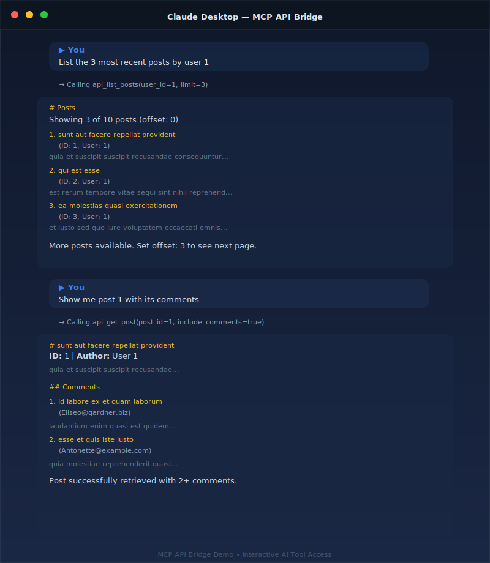

# REST API → MCP Server Bridge

Turn any REST API into an MCP server so Claude, Cursor, and other AI assistants can use it directly.

This is a production-quality starter kit that wraps [JSONPlaceholder](https://jsonplaceholder.typicode.com) (a free REST API) as 4 MCP tools. The real value is the **pattern** — swap the API client to point at your own API and you have a working MCP server.

---

<p align="center">
  
</p>

## What This Does

You give Claude (or any MCP-compatible AI assistant) access to a REST API through typed, validated tools:

```
You: "List the 5 most recent posts by user 3"

Claude calls: api_list_posts(user_id=3, limit=5)
→ Fetches GET /posts?userId=3
→ Returns formatted, paginated results

You: "Create a post about MCP servers"

Claude calls: api_create_post(title="Why MCP Servers Matter", body="...", user_id=1)
→ Sends POST /posts with validated payload
→ Returns the created resource
```

No prompt engineering needed. The AI assistant discovers the tools, validates inputs via Pydantic schemas, and gets structured responses.

## Quick Start

**Prerequisites:** Python 3.10+, [uv](https://docs.astral.sh/uv/) (recommended) or pip

```bash
# Clone and install
git clone https://github.com/BryceEWatson/mcp-api-bridge.git
cd mcp-api-bridge
uv pip install -e ".[dev]"

# Run the server (stdio transport)
python -m api_bridge_mcp.server

# Or run tests
pytest tests/ -v
```

**Add to Claude Desktop** — copy this into your `claude_desktop_config.json`:

```json
{
  "mcpServers": {
    "api-bridge": {
      "command": "uv",
      "args": ["run", "--directory", "/path/to/mcp-api-bridge", "api-bridge"]
    }
  }
}
```

Restart Claude Desktop. The 4 tools appear automatically.

## The Tools

| Tool | Method | What It Does | Key Patterns |
|------|--------|-------------|--------------|
| `api_list_posts` | GET /posts | List posts with filtering + pagination | Query params, in-memory pagination, dual format output |
| `api_get_post` | GET /posts/{id} | Fetch a post with optional comments | Resource lookup, related data joining |
| `api_create_post` | POST /posts | Create a new post | Write operations, input validation |
| `api_update_post` | PATCH /posts/{id} | Update post fields | Partial updates, existence checks |

Every tool supports `response_format: "markdown"` (human-readable) or `"json"` (machine-readable). All inputs are validated with Pydantic v2 models with field constraints. Every tool has MCP annotations (`readOnlyHint`, `destructiveHint`, `idempotentHint`, `openWorldHint`) set correctly.

## Adapting This For Your API

The whole point of this project is to show a repeatable pattern. Here's how to make it work with any REST API:

### Step 1: Replace the API client

Edit `src/api_bridge_mcp/api_client.py`. Change the base URL and add your auth:

```python
class APIClient:
    def __init__(self, base_url: str = "https://api.your-service.com/v1", timeout: int = 30):
        self.base_url = base_url
        self.timeout = httpx.Timeout(timeout)
        self.headers = {"Authorization": f"Bearer {os.environ['YOUR_API_KEY']}"}
```

The rest of the client (get/post/put/patch, error handling) works unchanged.

### Step 2: Define your Pydantic input models

Replace the post-related models in `server.py` with your domain:

```python
class SearchOrdersInput(BaseModel):
    model_config = ConfigDict(str_strip_whitespace=True, extra="forbid")

    customer_id: Optional[str] = Field(None, description="Filter by customer")
    status: Optional[str] = Field(None, description="Filter by status: pending, shipped, delivered")
    limit: int = Field(20, ge=1, le=100, description="Results per page")
```

### Step 3: Register your tools

Same `@mcp.tool` decorator pattern — pass a Pydantic model as the single parameter:

```python
@mcp.tool(
    name="orders_search",
    description="Search orders by customer and status.",
    annotations={"readOnlyHint": True, "idempotentHint": True}
)
async def orders_search(params: SearchOrdersInput) -> str:
    async with APIClient() as client:
        query = {}
        if params.customer_id:
            query["customer_id"] = params.customer_id
        if params.status:
            query["status"] = params.status
        orders = await client.get("/orders", params=query)
        return format_orders(orders[:params.limit])
```

### Step 4: Update the Claude Desktop config

Point the config at your new server. That's it.

## Project Structure

```
mcp-api-bridge/
├── README.md                          ← You are here
├── PLAN.md                            ← Design decisions and research
├── pyproject.toml                     ← PEP 621 packaging
├── claude_desktop_config.json         ← Example Claude Desktop config
├── src/
│   └── api_bridge_mcp/
│       ├── __init__.py
│       ├── api_client.py              ← HTTP client (swap this for your API)
│       └── server.py                  ← MCP tools (4 tools, ~530 lines)
└── tests/
    ├── conftest.py                    ← Shared fixtures and mock data
    ├── test_client.py                 ← API client tests (14 tests)
    ├── test_tools.py                  ← Tool tests (32 tests)
    └── test_e2e_mcp.py               ← End-to-end MCP protocol tests (28 tests)
```

The architecture separates the **API layer** (api_client.py) from the **MCP layer** (server.py). When adapting for a new API, you primarily modify api_client.py and the Pydantic models — the MCP wiring stays the same.

## Design Decisions

These are documented in detail in [PLAN.md](./PLAN.md). The short version:

**JSONPlaceholder as the demo API** — zero friction (no auth, no signup, no rate limits), full CRUD, and obviously a stand-in so the pattern is the focus, not the domain.

**Python + FastMCP** — the MCP Python SDK's high-level framework. Handles tool registration, input schema generation, and transport automatically. Fewer lines, fewer bugs.

**stdio transport** — the right default for local-first MCP servers. Add `mcp.run(transport="streamable_http", port=8000)` for remote deployment.

**Pydantic v2 for validation** — every tool input is a typed model with constraints. The AI assistant sees the schema and knows exactly what to send.

**Dual response formats** — markdown for when a human is reading Claude's output, JSON for when another system is consuming it.

## Running Tests

```bash
# All tests
pytest tests/ -v

# Just the API client tests
pytest tests/test_client.py -v

# Just the tool tests
pytest tests/test_tools.py -v

# End-to-end MCP protocol tests (hits live JSONPlaceholder API)
pytest tests/test_e2e_mcp.py -v
```

74 tests covering input validation, output formatting, pagination, error handling, and end-to-end MCP protocol tests against the live API. Unit and tool tests use `pytest-httpx` to mock HTTP responses (fast and deterministic). E2e tests exercise tool discovery, schema constraints, annotations, and real API calls over the MCP protocol — including 2 stdio transport tests using the same transport Claude Desktop uses.

## Built With

- [FastMCP](https://github.com/modelcontextprotocol/python-sdk) — MCP Python SDK
- [httpx](https://www.python-httpx.org/) — async HTTP client
- [Pydantic v2](https://docs.pydantic.dev/) — input validation
- [JSONPlaceholder](https://jsonplaceholder.typicode.com) — demo REST API
- [pytest](https://docs.pytest.org/) + [pytest-httpx](https://github.com/Colin-b/pytest_httpx) — testing

## About

Built by **Bryce Watson** — senior engineer (10+ years, ex-eBay) specializing in AI engineering, MCP servers, and production AI systems. Contributor to Anthropic's Python SDK.

- **Upwork:** [upwork.com/freelancers/brycewatson](https://www.upwork.com/freelancers/brycewatson)
- **Site:** [brycewatson.com](https://brycewatson.com)
- **GitHub:** [github.com/BryceEWatson](https://github.com/BryceEWatson)

Need an MCP server built for your API? [Get in touch.](https://www.upwork.com/freelancers/brycewatson)
